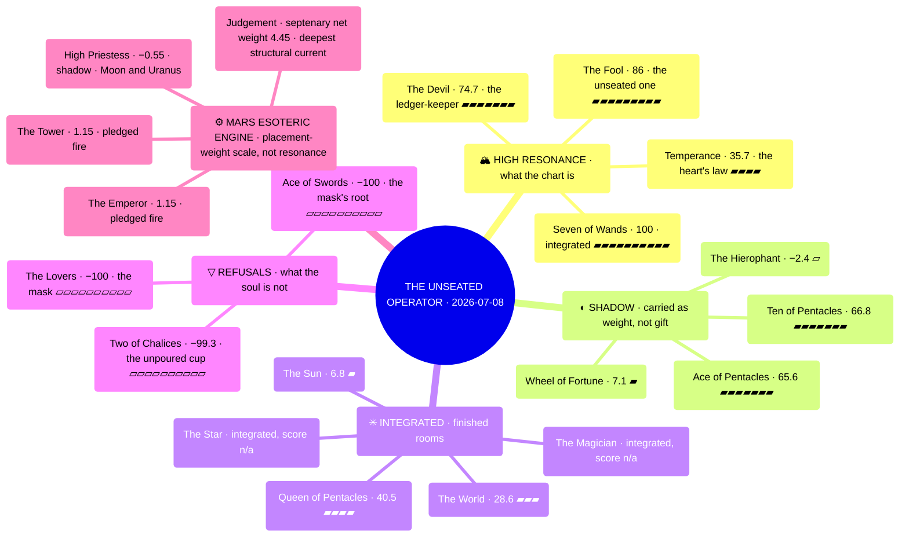

# Score Map — The Unseated Operator

> Visual companion to [[AIContext/Skills/PathsofRevSkills/notes/mythic-reading-2026-07-08|the Mythic Reading]].
> Bars: one block per 10 points of |score|. ▰ = positive resonance, ▱ = negative.
> **Two scales, kept apart:** the 78-card resonance engine (−100…+100) and the Mars esoteric engine's placement weights (≈ −1…+1.15). They are not comparable and share no branch.

## Exact scores

### 78-card resonance engine (−100 … +100)

| Card | Score | Register | Note |
|---|---:|---|---|
| Seven of Wands | 100 | integrated | highest minor · Mars's Chesed seat |
| The Fool | 86 | — | highest resonance in the deck · unseated |
| The Devil | 74.7 | — | second place · six contributors |
| Ten of Pentacles | 66.8 | shadow | inheritance carried as anxiety |
| Ace of Pentacles | 65.6 | shadow | root of Earth carried as weight |
| Queen of Pentacles | 40.5 | integrated | stewardship already clean |
| Temperance | 35.7 | — | Venus's sign-major |
| The World | 28.6 | integrated | Saturn's Da'ath |
| Wheel of Fortune | 7.1 | shadow | grace unclaimed, on Algol |
| The Sun | 6.8 | integrated | peregrine light, on Vega |
| The Hierophant | −2.4 | shadow | Jupiter's sign-major, twelfth house |
| Two of Chalices | −99.3 | shadow | deepest minor shadow · Moon's Binah seat |
| The Lovers | −100 | — | lowest in deck · the rising mask |
| Ace of Swords | −100 | — | the mask's element root |

*The Magician and The Star are marked integrated in the reading; no numeric score is given there.*

### Mars esoteric engine (placement weights, separate scale)

| Card | Weight | Register | Contributors |
|---|---:|---|---|
| The Emperor | 1.15 | — | Mars in domicile |
| The Tower | 1.15 | — | Mars in domicile |
| The High Priestess | −0.55 | shadow | Moon, Uranus |
| Judgement | 4.45 | — | third septenary net weight (its own sub-scale) |
